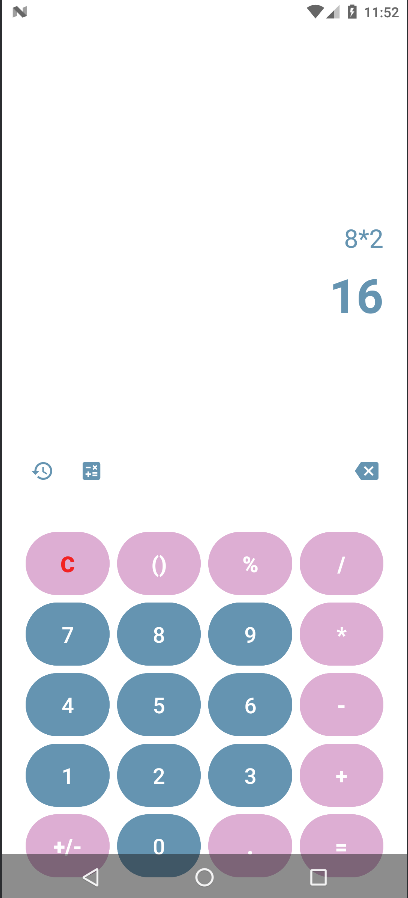

# 🧮 NorthCalc – Modern Android Calculator App



---

## 🚀 Features  

- **Clean Modern UI**  
  Minimal, elegant calculator interface with a focus on readability and usability.  

- **Basic Arithmetic Operations**  
  Supports addition, subtraction, multiplication, and division.  

- **Parentheses Support `()`**  
  Smart parentheses handling with automatic balancing for valid expressions.  

- **Live Expression Display**  
  Real-time expression building with a clear separation between expression and result.  

- **Error Handling**  
  Prevents invalid inputs and gracefully handles calculation errors.  

- **Backspace & Clear Controls**  
  Remove single characters or reset the entire expression instantly.  

- **Custom Styled Buttons**  
  Rounded, modern calculator buttons with operator highlighting.  

- **Edge-to-Edge Layout**  
  Fullscreen experience using Android Edge-to-Edge APIs.  

---

## 🛠 Tech Stack

### Android
- **Language:**  
  - Java  

- **UI:**  
  - XML (ConstraintLayout, GridLayout)  
  - Custom button styles & drawables  

- **Architecture:**  
  - Single-activity architecture  
  - Clean separation of UI and logic  

---

## ⚡ Usage

1. **Clone the repository**
   ```bash
   git clone https://github.com/m223rx/NorthCalc.git
   cd NorthCalc

   ```

2. **Open in Android Studio**
    - Android Studio Iguana or newer recommended

    - Gradle will sync automatically
    ```

3. **Run the app**  
    - Select a device or emulator

    - Click Run
    
---

## 🎨 Customization

- **UI Layout**

- res/values/styles.xml

- res/drawable/bg_calc_button.xml

- **Button Styles**

- res/values/styles.xml

- res/drawable/bg_calc_button.xml

- **Logic & Evaluation**

- MainActivity.java

- **Colors & Themes**

- res/values/colors.xml

- res/values/themes.xml

---

## 💡 Future Enhancements

- Scientific calculator mode

- Calculation history

- Percentage (%) logic improvements

- Material 3 design support

- Animations & haptic feedback

- Dark / Light theme toggle

---

## 👨‍💻 Developer

m223rx – 2025  

© 2025 m223rx. All rights reserved.
